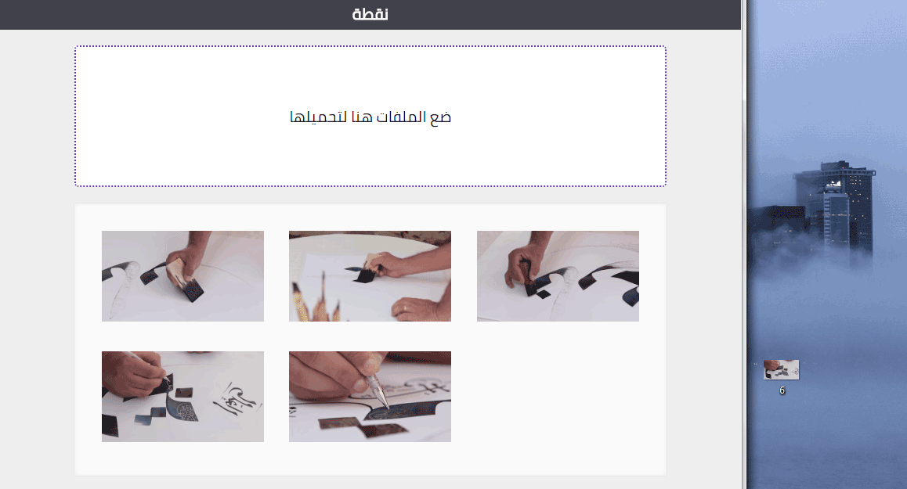

### Demo ###
------

> This app uses open-source frameworks and libraries: [Python 2.7](https://www.python.org/), [Django](https://www.djangoproject.com/), [JQuery](https://jquery.com/) and [DropZone](http://www.dropzonejs.com/).


### Installing prerequisites ###
------

1. Download and install [Python 2.7.x](https://www.python.org/downloads/)
2. Add Python path to your [System Environment Variables](http://www.aaronstannard.com/how-to-setup-a-proper-python-environment-on-windows/)
3. Install pip to manage your Python packages
4. Install Python packages by running in the command line
```
$ pip install -r requirements.txt
```


### 1. Create your project ###
------

Using the command line, run
```
$ django-admin startproject <your_project_name>
$ cd <your_project_name>
$ python manage.py startapp <your_app_name>
```


### 2. Reference your app  ###
------

Add <your_app_name> under INSTALLED_APPS in <your_project_name>/settings.py
```python
INSTALLED_APPS = [
    'django.contrib.admin',
    'django.contrib.auth',
    'django.contrib.contenttypes',
    'django.contrib.sessions',
    'django.contrib.messages',
    'django.contrib.staticfiles',
    '<your_app_name>',
]
```


### 3. Create your urls ###
------

Edit <your_project_name>/urls.py as follows
```python
from django.conf.urls import url
from django.contrib import admin
from <your_app_name> import views
urlpatterns = [
    url(r'^admin/', admin.site.urls),
    url(r'^$', views.upload, name='upload'),
]
```


### 4. Create your models ###
------

Edit <your_app_name>/models.py as follows
```python
from django.db import models
class UploadFile(models.Model):
    file = models.FileField(upload_to='<your_app_name>/static/files')
```


### 5. Create your views ###
------

Edit <your_app_name>/views.py as follows
```python
from django.shortcuts import render
from django.http import HttpResponse
from django import forms
from models import UploadFile
import json

class UploadFileForm(forms.ModelForm):
	class Meta:
		model = UploadFile
		fields = '__all__'

def upload(request):
	if request.method == 'POST':
		form = UploadFileForm(request.POST, request.FILES)
		if form.is_valid():
			new_file = UploadFile(file=request.FILES['file'])
			new_file.save()
			new_file_name = str(new_file.file).split('/')[-1]
			return HttpResponse(json.dumps({'image':new_file_name}), content_type="application/json")
	else:
		form = UploadFileForm()
	images = [str(f.file).split('/')[-1] for f in UploadFile.objects.all()]
	return render(request, '<your_app_name>/upload.html', {'form':form, 'images':images})
```


### 6. Create your templates (HTML) ###
------

1. Create a folder <your_app_name>/templates/<your_app_name>/
2. Create an HTML file <your_app_name>/templates/<your_app_name>/upload.html
3. Edit your HTML to add the following
```html
<!DOCTYPE html>

<html>
	<head>
		<meta charset="UTF-8">
		<title> نقطة </title>
		<link href=""  	rel="stylesheet" type="text/css" />
		<link href=""  		rel="stylesheet" type="text/css" />
	</head>
	<body>
		<header>
			<h4> نقطة </h4>
		</header>
		<form class="dropzone" action="" method="post" enctype="multipart/form-data">
			
		</form>
		<div class="images">
			
				
			
		</div>
		<script src="" 	type="text/javascript"></script>
		<script src="" 	type="text/javascript"></script>
		<script src="" 		type="text/javascript"></script>
	</body>
</html>
```


### 7. Create your static files (JS + CSS) ###
------

1. Create a folder <your_app_name>/static/
2. Download the JS + CSS files from this repository to your static folder
> dropzone.css + dropzone.js can be downloaded from [DropZone](http://www.dropzonejs.com/) and 
> jquery.min.js can be downloaded from [JQuery](https://jquery.com/download/)


### 8. Run your app ###
------

Using the command line, run
```
$ python manage.py makemigrations
$ python manage.py migrate
$ python manage.py runserver
```
Now go to [http://localhost:8000/](http://localhost:8000/)